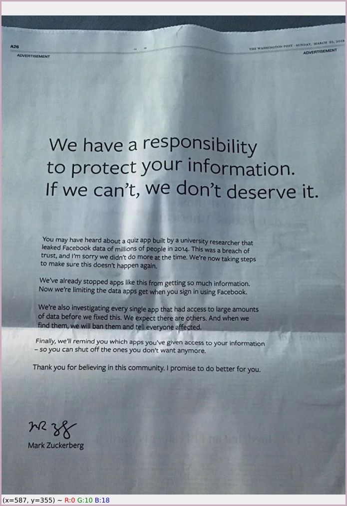
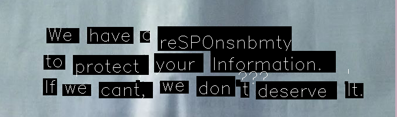
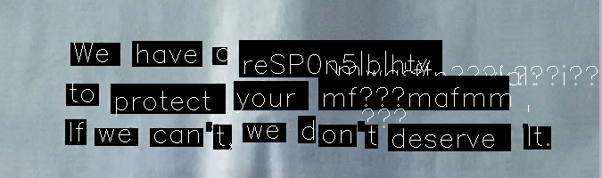
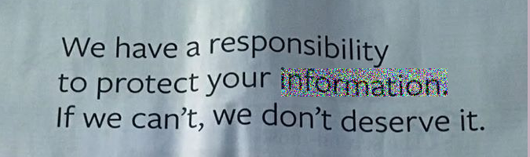

This repository contains the implementation of the adversarial attack using
genetic algorithms on the [tesseract OCR](https://github.com/tesseract-ocr/tesseract).

# Example
The protection of the information is one of the key priorities, according to the
Mark Zuckerberg:
.

Let's use an OCR on this image!

.

Using this tool, one can selectively hide the information!

.

But the human still can read the text

.

# Usage
```
usage: main.py [-h] -i IMAGE [-a] [-p POP_SIZE] [-m MUTATION_RATE]

This program allows user to detect and recognize printed text on images, as well as get the
contents of the image as a text

optional arguments:
  -h, --help            show this help message and exit
  -i IMAGE, --image IMAGE
                        Path to the image
  -a, --annotate        Annotate the image
  -p POP_SIZE, --pop_size POP_SIZE
                        Population size
  -m MUTATION_RATE, --mutation_rate MUTATION_RATE
                        Mutation rate
```
